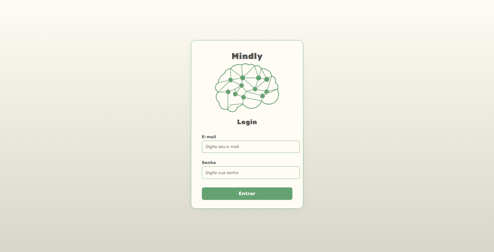
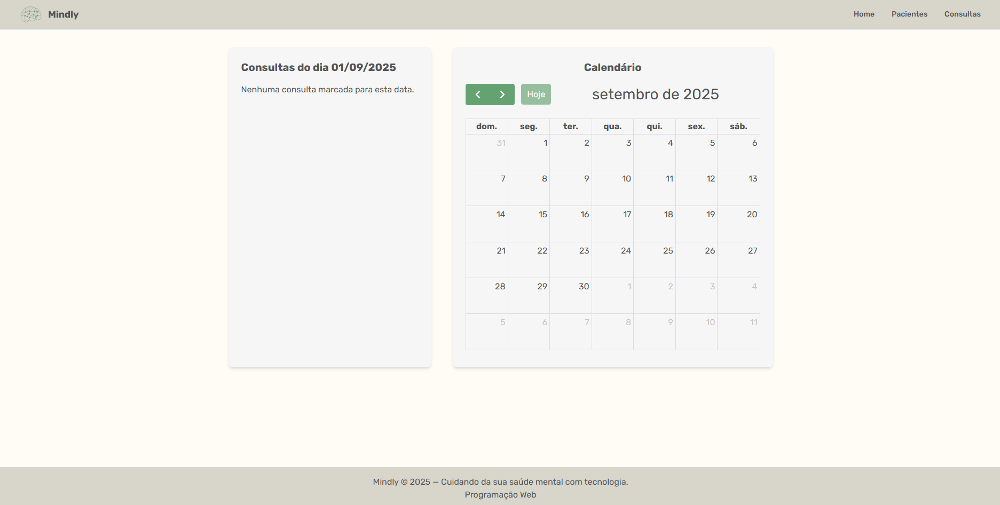
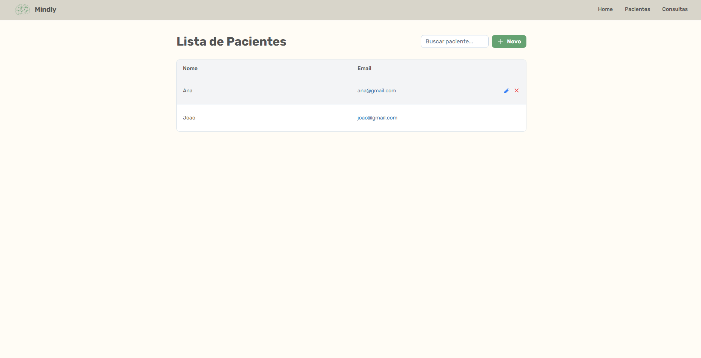
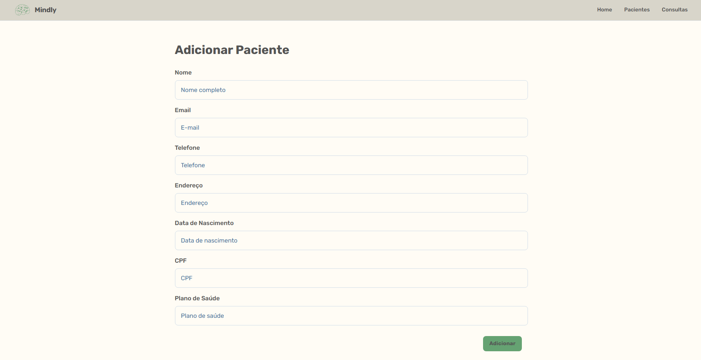
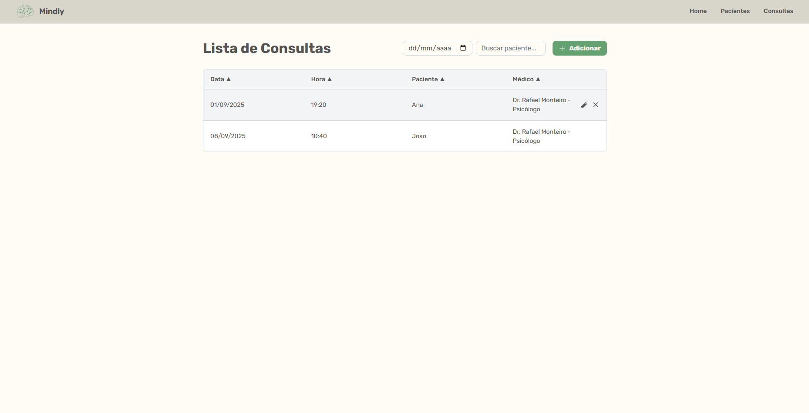
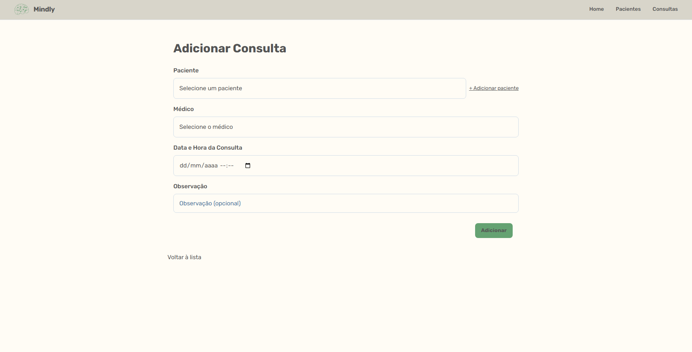

# 🧠 Mindly - Sistema de Agendamento para Clínicas de Saúde Mental

**Mindly** é um sistema web para facilitar o gerenciamento de atendimentos em clínicas de saúde mental. Voltado para **psicólogos**, **psiquiatras** e **recepcionistas**, oferece um ambiente seguro, simples e acessível para organização de consultas e histórico de pacientes.

---

## 👥 Perfis de Usuário

* **Recepcionista**: realiza, edita e cancela agendamentos.
* **Profissionais (Psicólogo/Psiquiatra)**: definem horários disponíveis, bloqueiam horários e acessam o histórico clínico de seus pacientes.
* **Administrador**: cadastra novos profissionais e colaboradores.

---

## ✅ Funcionalidades Principais

* 📅 **Agendamento de Consultas** – criar, editar e cancelar com base na agenda dos profissionais.
* 👤 **Cadastro de Pacientes** – dados como nome, CPF, telefone, data de nascimento e e-mail.
* 🗓️ **Agenda Dinâmica** – visualização diária dinâmica.
* 🔐 **Login com Controle de Acesso** – apenas perfis de membros da clínica podem ter acesso.

---

## 💻 Tecnologias Utilizadas

* **Java 17** – linguagem principal
* **Spring Boot 3.x** – framework para aplicações web
* **Spring MVC** – controllers, rotas e views
* **Spring Data JPA (Jakarta Persistence)** – persistência ORM
* **Thymeleaf** – templates HTML dinâmicos
* **Jakarta Validation** – validação com anotações (`@NotNull`, `@NotBlank` etc.)
* **Tailwind CSS** – estilização (utilitários CSS)
* **HTML/CSS** – estrutura e estilo de páginas
* **Git** – versionamento

---

## 🚀 Como Executar (detalhado, sem Maven)

### 0) Pré-requisitos

1. **Java 17 JDK** instalado

   * Verifique: `java -version` deve mostrar **17.x**
   * Windows: baixe o JDK 17 (Temurin, Oracle ou Zulu).&#x20;

2. **Git** instalado

   * Verifique: `git --version`

3. **Visual Studio Code** com extensões:

   * **Extension Pack for Java** (Microsoft)
   * **Spring Boot Extension Pack** (Pivotal/VMware)

---

### 1) Clonar o repositório

```bash
# use HTTPS ou SSH conforme seu GitHub
git clone https://github.com/usuario/mindly.git
cd mindly
```

---

### 2) Abrir o projeto no VS Code

* No VS Code, **File → Open Folder** e selecione a pasta do projeto.
* Aguarde a indexação do Java. O VS Code deve detectar a estrutura do projeto e preparar o classpath.

> Dica: se aparecer um prompt “**Importar projeto Java**”, aceite.

---

### 3) Executar a aplicação no VS Code

Há duas maneiras simples dentro do VS Code:

**A) Pela classe principal**

1. No Explorador, abra a classe com `@SpringBootApplication` (ex.: `MindlyApplication.java`).
2. Clique em **Run** ▶️ acima do método `main` ou use **Run → Run Without Debugging**.

**B) Pelo Spring Boot Dashboard**

1. Abra o painel **Spring Boot Dashboard** (ícone de folha na barra lateral ou `Ctrl+Shift+P` → “Spring Boot Dashboard: Focus on Contributions View”).
2. Localize o projeto **Mindly** e clique em **Run**.

Quando iniciar com sucesso, você verá logs parecidos com: `Tomcat started on port(s): 8080`.

Acesse em: [**http://localhost:8080**](http://localhost:8080)

---

### 4) Problemas comuns e soluções

* \*\*Erro: \*\*\`\` → verifique as credenciais do banco e se o servidor está ativo.
* **Erro de versão do Java** → garanta que o VS Code está usando o **JDK 17** (Settings → `java.configuration.runtimes`).
* **Porta 8080 em uso** → mude `server.port` para outra (ex.: `server.port=8081`).
* **Classe principal não aparece para rodar** → aguarde a conclusão do “Java Projects Import” ou reabra o VS Code.

---

## 🖼️ Wireframe

### Login


### Tela Home


### Lista de Pacientes


### Adicionar Paciente


### Lista de Consultas


### Adicionar Consulta


---

## 📂 Estrutura de Pastas

```
MINDLY-PROG.WEB/
├── src/
│   ├── main/
│   │   ├── java/br/edu/iff/ccc/mindly/
│   │   │   ├── controller/
│   │   │   │   ├── restapi/
│   │   │   │   │   ├── ConsultaRestController.java
│   │   │   │   │   ├── PacienteRestController.java
│   │   │   │   │   └── UsuarioRestController.java
│   │   │   │   └── view/
│   │   │   │       ├── ConsultaViewController.java
│   │   │   │       ├── HomePageViewController.java
│   │   │   │       ├── LoginViewController.java
│   │   │   │       └── PacienteViewController.java
│   │   │   ├── dto/
│   │   │   │   ├── ConsultaRequestDTO.java
│   │   │   │   ├── ConsultaResponseDTO.java
│   │   │   │   ├── PacienteRequestDTO.java
│   │   │   │   ├── PacienteResponseDTO.java
│   │   │   │   ├── PacienteUpdateDTO.java
│   │   │   │   ├── UsuarioCadastroDTO.java
│   │   │   │   ├── UsuarioLoginDTO.java
│   │   │   │   └── UsuarioResponseDTO.java
│   │   │   ├── entities/
│   │   │   │   ├── Consulta.java
│   │   │   │   ├── Paciente.java
│   │   │   │   ├── Role.java
│   │   │   │   └── Usuario.java
│   │   │   ├── exception/
│   │   │   │   ├── BusinessException.java
│   │   │   │   ├── ForbiddenException.java
│   │   │   │   ├── InvalidCredentialsException.java
│   │   │   │   ├── ResourceNotFoundException.java
│   │   │   │   ├── RestExceptionHandler.java
│   │   │   │   └── WebExceptionHandler.java
│   │   │   ├── repository/
│   │   │   │   ├── ConsultaRepository.java
│   │   │   │   ├── PacienteRepository.java
│   │   │   │   └── UsuarioRepository.java
│   │   │   ├── service/
│   │   │   │   ├── AuthService.java
│   │   │   │   ├── ConsultaService.java
│   │   │   │   ├── PacienteService.java
│   │   │   │   └── UsuarioService.java
│   │   │   └── MindlyApplication.java
│   │   └── resources/
│   │       ├── static/
│   │       │   ├── css/
│   │       │   │   ├── error-pages.css
│   │       │   │   ├── login.css
│   │       │   │   └── style.css
│   │       │   ├── image/
│   │       │   │   ├── favicon-32x32-sem-fundo.png
│   │       │   │   ├── Favicon-32x32.png
│   │       │   │   ├── favicon-180x180-sem-fundo.png
│   │       │   │   ├── Favicon-180x180.png
│   │       │   │   ├── favicon.ico
│   │       │   │   └── logo_mindly.png
│   │       │   └── js/
│   │       │       ├── form-masks.js
│   │       │       ├── home.js
│   │       │       └── lista.js
│   │       ├── templates/
│   │       │   ├── consultas/
│   │       │   │   ├── adicionar.html
│   │       │   │   ├── editar.html
│   │       │   │   └── lista.html
│   │       │   ├── error/
│   │       │   │   ├── 404.html
│   │       │   │   └── error.html
│   │       │   ├── fragmentos/
│   │       │   │   ├── footer.html
│   │       │   │   └── navbar.html
│   │       │   ├── pacientes/
│   │       │   │   ├── adicionar.html
│   │       │   │   ├── editar.html
│   │       │   │   └── lista.html
│   │       │   ├── index.html
│   │       │   └── login.html
│   │       ├── application.properties
│   │       ├── data.sql
│   │       └── messages.properties
│   └── test/java/br/edu/iff/ccc/mindly/
│       └── MindlyApplicationTests.java
├── .mvn/wrapper/
│   ├── maven-wrapper.properties
│   └── mvnw
├── config/
│   └── OpenApiConfig.java
├── data/
│   ├── mindly_db.mv.db
│   └── mindly_db.trace.db
├── Docs/
├── wireframe/
│   ├── wireframe_adicionarConsulta.png
│   ├── wireframe_adicionarPaciente.png
│   ├── wireframe_home.png
│   ├── wireframe_listaConsultas.png
│   ├── wireframe_listaPacientes.png
│   ├── wireframe_login.png
│   └── Diagrama de Classes.png
├── target/
├── .gitattributes
├── .gitignore
├── mvnw
├── mvnw.cmd
├── pom.xml
├── ATIVIDADEO2.md
├── LICENSE
├── README.md
└── DDD
```
---

## 🌐 Documentação da API (Swagger)

A documentação interativa da API está disponível via **Swagger UI**. Siga os passos abaixo para acessá-la:

### 1) Certifique-se de que a API está rodando
Siga os passos da seção **🚀 Como Executar** para iniciar a aplicação.  
Por padrão, a API estará disponível em:  
```http://localhost:8080```

### 2) Acessar o Swagger
Abra seu navegador e acesse:  
📖 [Swagger UI](http://localhost:8080/swagger-ui/index.html)

Aqui você poderá:
* Visualizar todos os endpoints da API.
* Testar requisições GET, POST, PUT e DELETE.
* Conferir os parâmetros, respostas e exemplos de uso.

> 💡 Dica: o Swagger atualiza automaticamente quando novos endpoints são adicionados ao projeto.

---
## 🙌 Agradecimentos
Agradecemos por explorar o projeto **Mindly**!
